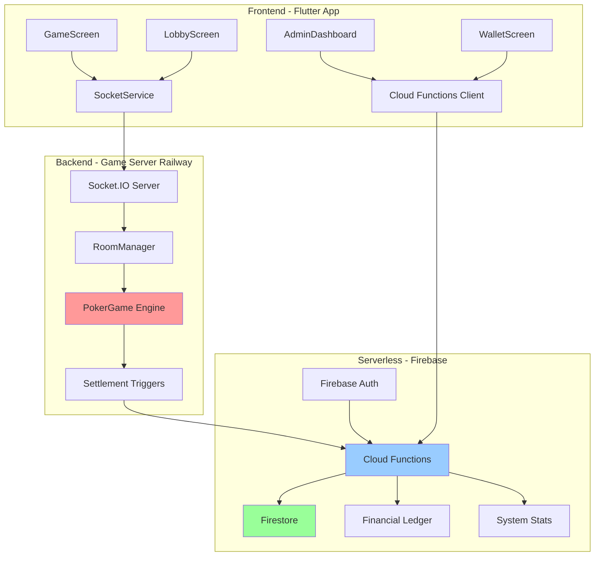
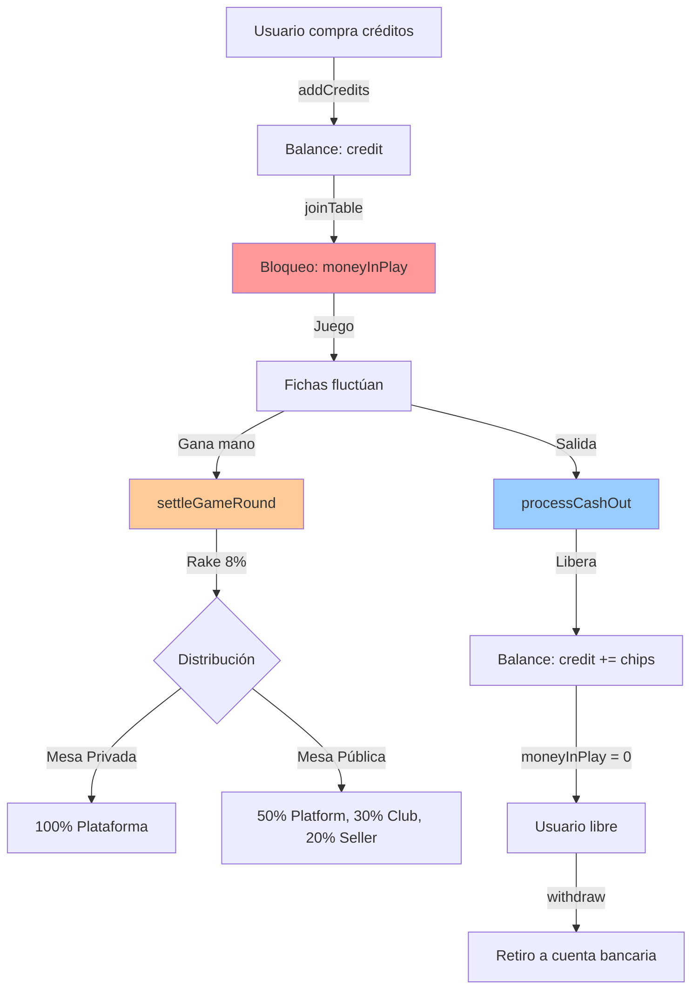

# 🔍 Análisis Completo del Proyecto Poker Imperial

> **Fecha de Análisis:** Diciembre 2025  
> **Autor:** Análisis Técnico Completo  
> **Versión del Proyecto:** 1.0.1

---

## 📋 Índice

1. [Resumen Ejecutivo](#resumen-ejecutivo)
2. [Arquitectura del Proyecto](#arquitectura-del-proyecto)
3. [Análisis de Componentes](#análisis-de-componentes)
4. [Sistema Económico](#sistema-económico)
5. [Inconsistencias Identificadas](#inconsistencias-identificadas)
6. [Recomendaciones](#recomendaciones)
7. [Conclusiones](#conclusiones)

---

## 🎯 Resumen Ejecutivo

**Poker Imperial** es una plataforma completa de poker en tiempo real construida con una arquitectura distribuida moderna que separa responsabilidades entre:

- **Frontend**: Flutter (multiplataforma)
- **Backend de Tiempo Real**: Node.js + Socket.IO (desplegado en Railway/Render)
- **Backend Serverless**: Firebase Cloud Functions
- **Base de Datos**: Cloud Firestore
- **Autenticación**: Firebase Auth

### Características Principales

✅ **Funcionalidades Implementadas:**
- Sistema de poker Texas Hold'em en tiempo real
- Gestión de créditos y economía del juego
- Sistema de clubs y torneos
- Panel de administración completo
- Sistema de rake con distribución multi-nivel (Plataforma/Club/Seller)
- Seguridad con firmas HMAC-SHA256
- Manejo de desconexiones y AFK
- Sistema de recompra (rebuy)
- Mesas públicas y privadas

### Stack Tecnológico

| Componente | Tecnología | Versión |
|-----------|-----------|---------|
| **Frontend** | Flutter | SDK 3.6.0 |
| **Backend RT** | Node.js + Socket.IO | Node 18+ |
| **Functions** | Firebase Cloud Functions | Node 20 |
| **Database** | Cloud Firestore | Latest |
| **Auth** | Firebase Auth | Latest |
| **Poker Engine** | pokersolver | 2.1.4 |

---

## 🏗️ Arquitectura del Proyecto

### Estructura de Directorios

```
e:\Poker/
├── app/                      # Flutter Application (184 archivos)
│   ├── lib/
│   │   ├── screens/         # 22 pantallas (GameScreen, Lobby, Admin, etc.)
│   │   ├── widgets/         # 45 componentes reutilizables
│   │   ├── providers/       # 5 providers (Auth, Wallet, Club, Tournament, Language)
│   │   ├── services/        # 3 servicios (Socket, Auth, Firestore)
│   │   ├── models/          # Modelos de datos
│   │   └── utils/           # Utilidades
│   ├── assets/              # Imágenes y audio
│   └── pubspec.yaml         # Dependencias Flutter
│
├── functions/               # Firebase Cloud Functions (37 archivos)
│   ├── src/
│   │   ├── functions/       # 24 cloud functions
│   │   │   ├── gameEconomy.ts    # 768 líneas - Motor económico principal
│   │   │   ├── credits.ts        # Gestión de créditos
│   │   │   ├── admin.ts          # Funciones administrativas (57KB)
│   │   │   ├── tournament.ts     # Sistema de torneos (27KB)
│   │   │   ├── club.ts           # Gestión de clubs
│   │   │   └── analytics.ts      # Métricas y estadísticas
│   │   ├── utils/           # Utilidades (liveFeed, helpers)
│   │   └── types.ts         # Definiciones TypeScript
│   └── package.json
│
├── server/                  # Game Server WebSocket (12 archivos)
│   ├── src/
│   │   ├── index.ts         # 743 líneas - Entry point + Socket handlers
│   │   ├── game/
│   │   │   ├── PokerGame.ts      # 1461 líneas - Motor de poker
│   │   │   ├── RoomManager.ts    # 33KB - Gestión de salas
│   │   │   └── BotLogic.ts       # Lógica de bots
│   │   └── middleware/
│   │       └── firebaseAuth.ts   # Verificación de tokens
│   └── package.json
│
├── firestore.rules          # Reglas de seguridad (166 líneas)
├── firestore.indexes.json   # Índices compuestos
└── [Documentación]          # 28 archivos MD con documentación

```

### Diagrama de Arquitectura



---

## 🔬 Análisis de Componentes

### 1. App (Flutter) - Frontend

#### Estructura de Pantallas

| Categoría | Pantallas | Descripción |
|-----------|-----------|-------------|
| **Juego** | `game_screen.dart` (65KB) | Mesa de poker principal con renderizado de jugadores, cartas, acciones |
| | `game_zone_screen.dart` | Zona de juego |
| | `table_lobby_screen.dart` (38KB) | Lobby de mesa con jugadores |
| **Navegación** | `lobby_screen.dart` (40KB) | Lobby principal con lista de mesas |
| **Autenticación** | `login_screen.dart` (13KB) | Login con Firebase Auth |
| | `setup_account_screen.dart` | Configuración inicial |
| **Perfil** | `profile_screen.dart` (34KB) | Perfil de usuario con estadísticas |
| | `wallet_screen.dart` (dentro de widgets) | Gestión de billetera |
| **Admin** | `admin/` (5 pantallas) | Dashboard, usuarios, estadísticas, gestión |
| **Clubs** | `club/` (6 pantallas) | Gestión completa de clubs |
| **Torneos** | `tournament/` (3 pantallas) | Lobby, detail, registro |

#### Providers (Estado Global)

1. **AuthProvider** (2.7KB) - Gestión de autenticación
2. **WalletProvider** (4.3KB) - Estado de billetera y créditos
3. **ClubProvider** (8.5KB) - Estado de clubs y miembros
4. **TournamentProvider** (7.9KB) - Estado de torneos
5. **LanguageProvider** (6.7KB) - Internacionalización

#### Dependencias Clave

```yaml
dependencies:
  flutter_sdk: ^3.6.0
  socket_io_client: ^3.1.2      # WebSocket
  provider: ^6.1.5              # State management
  firebase_core: ^3.8.1         # Firebase
  firebase_auth: ^5.3.3         # Autenticación
  cloud_firestore: ^5.5.2       # Database
  cloud_functions: ^5.2.2       # Functions client
  fl_chart: ^0.69.0             # Gráficas (admin)
  google_fonts: ^6.3.0          # Tipografía
  intl: ^0.19.0                 # Formato de números/fechas
```

### 2. Functions (Firebase Cloud Functions) - Backend Serverless

#### Funciones Económicas Principales

##### `gameEconomy.ts` (768 líneas - El corazón del sistema)

**Funciones exportadas:**

1. **`joinTable`** - Entrada a mesa
   - Validación de balance
   - Idempotencia (previene duplicados)
   - Transacción atómica en Firestore
   - Bloqueo de créditos (`moneyInPlay`)
   - Creación de sesión activa

2. **`settleGameRound`** - Liquidación de mano
   - Cálculo de rake (8% del pot)
   - Distribución multi-nivel (Platform 50%, Club 30%, Seller 20%)
   - Actualización de stacks desde servidor (source of truth)
   - Verificación HMAC opcional
   - Registro en `financial_ledger`

3. **`processCashOut`** - Salida de mesa
   - Lectura de fichas finales (source of truth: `poker_tables`)
   - Cálculo de ganancia/pérdida
   - Devolución de créditos a billetera
   - Limpieza de estado (`moneyInPlay = 0`, `currentTableId = null`)
   - Soporte para cashout iniciado por servidor (con firma HMAC)

4. **`universalTableSettlement`** - Cierre forzado de mesa
   - Liquidación de todos los jugadores
   - Sin aplicar rake (devolución completa)
   - Limpieza de sesiones

**Arquitectura de Seguridad:**

```typescript
// Firma HMAC-SHA256 para comunicación Server → Functions
const GAME_SECRET = process.env.GAME_SECRET || 'default-secret';

function verifySignature(authPayload: string, signature: string): boolean {
    const computedSignature = crypto
        .createHmac('sha256', GAME_SECRET)
        .update(authPayload)
        .digest('hex');
    
    return crypto.timingSafeEqual(
        Buffer.from(computedSignature, 'hex'),
        Buffer.from(signature, 'hex')
    );
}
```

#### Otras Cloud Functions

| Archivo | Líneas | Funciones Clave |
|---------|--------|----------------|
| `admin.ts` | ~57KB | `adminMintCredits`, `getSystemStats`, `repairStuckSessions` |
| `credits.ts` | 17KB | `addCredits`, `deductCredits`, `withdraw` |
| `tournament.ts` | 27KB | `createTournament`, `registerForTournament`, `startTournament` |
| `club.ts` | 10KB | `createClub`, `joinClub`, `ownerTransferCredit` |
| `analytics.ts` | 12KB | `get24hMetrics`, `getTopHolders`, `getWeeklyTrends` |

#### Triggers en Firestore

- **`settlementTrigger`** - Escucha `_trigger_settlement/{docId}` para liquidar manos
- **`cashoutTrigger`** - Escucha `_trigger_cashout/{docId}` para procesar salidas
- **`tournamentTriggers`** - Gestión automática de torneos

### 3. Server (Node.js) - Game Server

#### `index.ts` (743 líneas) - Socket.IO Handlers

**Eventos principales:**

```typescript
// Autenticación
socket.on('authenticate', async (data: { token: string }))

// Gestión de salas
socket.on('create_room', async (data))
socket.on('join_room', async ({ roomId, playerName, token, isSpectator }))
socket.on('join_spectator', ({ roomId }))
socket.on('close_room', async ({ roomId }))

// Juego
socket.on('start_game', ({ roomId }))
socket.on('game_action', ({ roomId, action, amount }))
socket.on('player_ready', ({ roomId, isReady }))

// Desconexión
socket.on('disconnect', async ())

// Top-up
socket.on('request_top_up', async ({ roomId, amount, token }))
```

**Flujo de Entrada:**
1. Usuario llama `join_room` con token
2. Servidor verifica token con Firebase Admin SDK
3. Llama a `callJoinTableFunction` (Cloud Function `joinTable`)
4. Si tiene fondos suficientes, crea sesión y une al jugador
5. Emite `player_joined` a la sala

**Optimización: Socket First, Database Later**

```typescript
// Emitir estado inmediatamente
io.to(roomId).emit('game_update', gameState);

// Persistir en background (no blocking)
setImmediate(async () => {
    await admin.firestore()
        .collection('poker_tables')
        .doc(roomId)
        .set(gameState, { merge: true });
});
```

#### `PokerGame.ts` (1461 líneas) - Motor del Juego

**Características implementadas:**

- ✅ Texas Hold'em completo (Pre-flop, Flop, Turn, River, Showdown)
- ✅ Sistema de blinds dinámicos (Heads-up y 3+ jugadores)
- ✅ Side Pots para escenarios All-In múltiples
- ✅ Detección de manos con `pokersolver`
- ✅ Sistema AFK con timeout de 15 segundos
- ✅ Sistema de rebuy con timeout de 30 segundos
- ✅ Bots con lógica básica
- ✅ Auto-avance a showdown cuando todos están all-in
- ✅ Detección de "Last Man Standing" (victoria por abandono)

**Ejemplo de Side Pots:**

```typescript
private sidePots: Array<{
    amount: number;
    eligiblePlayerIds: Set<string>;
    maxContribution: number;
}> = [];

private calculateSidePots() {
    // Implementación compleja para dividir botes
    // cuando jugadores tienen diferentes stack sizes
}
```

#### `RoomManager.ts` (33KB) - Gestión de Salas

**Responsabilidades:**

- Crear/eliminar salas
- Gestionar lista de jugadores
- Countdown para inicio de juego (requiere 2+ jugadores listos)
- Cleanup automático de salas vacías
- Emisión de eventos via callback
- Integración con Firestore para persistencia

---

## 💰 Sistema Económico

### Flujo Completo del Dinero



### Colecciones en Firestore

#### 1. `users`

```typescript
{
    uid: string,
    credit: number,              // Balance disponible
    moneyInPlay: number,         // Dinero bloqueado en mesa
    currentTableId: string | null, // Mesa actual
    clubId?: string,             // ID del club (opcional)
    sellerId?: string,           // ID del vendedor (opcional)
    role: 'admin' | 'club' | 'seller' | 'player',
    totalRakePaid: number,
    commissionEarned: number     // Para sellers
}
```

#### 2. `poker_sessions`

```typescript
{
    sessionId: string,
    userId: string,
    roomId: string,
    buyInAmount: number,         // Buy-in inicial
    currentChips: number,        // Fichas actuales
    totalRakePaid: number,       // Rake total pagado
    status: 'active' | 'completed',
    startTime: Timestamp,
    endTime?: Timestamp,
    closedReason?: string
}
```

#### 3. `poker_tables`

```typescript
{
    tableId: string,
    hostId: string,
    isPublic: boolean,
    minBuyIn: number,
    maxBuyIn: number,
    smallBlind: number,
    bigBlind: number,
    maxPlayers: number,
    status: 'waiting' | 'active' | 'finished',
    players: [
        {
            id: string,
            uid: string,
            chips: number,          // SOURCE OF TRUTH
            currentBet: number,
            isFolded: boolean,
            isAllIn: boolean
        }
    ],
    pot: number,
    communityCards: string[]
}
```

#### 4. `financial_ledger`

```typescript
{
    type: 'RAKE' | 'SESSION_END' | 'BUY_IN' | 'CASH_OUT',
    amount: number,
    tableId: string,
    handId?: string,
    potTotal?: number,
    rakeAmount?: number,
    winnerUid?: string,
    distribution?: {
        platform: number,
        club: number,
        seller: number
    },
    timestamp: Timestamp
}
```

#### 5. `system_stats`

```typescript
{
    docId: 'economy',
    accumulated_rake: number,    // Rake total de la plataforma
    dailyGGR: number,            // Gross Gaming Revenue diario
    total_volume: number,        // Volumen total de pots
    hands_played: number,        // Manos jugadas
    lastUpdated: Timestamp
}
```

### Reglas de Distribución del Rake

#### Mesa Privada (Club)

```
Rake = 8% del Pot
Distribución:
├─ 100% → Plataforma (system_stats.accumulated_rake)
```

#### Mesa Pública

```
Rake = 8% del Pot
Distribución:
├─ 50% → Plataforma (system_stats.accumulated_rake)
├─ 30% → Club Owner (clubs.walletBalance)
└─ 20% → Seller (users.credit si sellerId existe, sino → Plataforma)
```

**Ejemplo:**

```
Pot: 1000 fichas
Rake: 80 fichas (8%)

Mesa Pública (jugador con Club y Seller):
├─ Platform: 40 fichas
├─ Club:     24 fichas
└─ Seller:   16 fichas
Total distribuido: 80 fichas ✅

Mesa Pública (jugador sin Club - Independiente):
└─ Platform: 80 fichas (100%)
```

### Políticas de Rake

| Escenario | Rake Aplicado | Cuándo |
|-----------|---------------|---------|
| **Ganancia de Mano** | 8% del pot | En `settleGameRound` |
| **Cashout con Ganancia** | ❌ No más rake | Ya se cobró en cada mano |
| **Cashout con Pérdida** | ❌ No rake | No hay ganancia |
| **Cierre de Mesa** | ❌ No rake | Devolución completa |

---

## ⚠️ Inconsistencias Identificadas

### 1. **CRÍTICO: Doble Rake Potencial**

**Ubicación:** `gameEconomy.ts` - `processCashOut` (líneas 550-600)

**Problema:**

Existe código legacy comentado que calculaba rake en el cashout:

```typescript
// LEGACY CODE (comentado, pero peligroso si se reactiva):
if (grossProfit > 0) {
    const cashOutRake = Math.floor(grossProfit * 0.08);
    // ... distribución de rake
}
```

**Impacto:**
- Si se reactiva este código, el rake se cobraría dos veces:
  1. En cada mano ganada (`settleGameRound`)
  2. Al salir de la mesa (`processCashOut`)
- Esto duplicaría la comisión de la plataforma

**Estado Actual:** ✅ **Mitigado** - El código está comentado y no se ejecuta

**Recomendación:** Eliminar completamente este código legacy para evitar confusión futura

### 2. **Inconsistencia en Nombres de Campos**

**Ubicación:** `PokerGame.ts` (línea 333-334) y Flutter `game_screen.dart`

**Problema:**

El backend envía dos campos para la misma información:

```typescript
// Backend (PokerGame.ts)
players: this.players.map(p => ({
    bet: p.currentBet,         // Nombre original
    currentBet: p.currentBet,  // Fix para Flutter
}))
```

**Impacto:**
- Duplicación de datos en red
- Confusión sobre qué campo usar
- Posible desincronización si se actualiza uno y no el otro

**Recomendación:** Estandarizar a `currentBet` en todo el stack y eliminar `bet`

### 3. **Source of Truth Ambiguo para Chips**

**Ubicación:** `server/index.ts`, `gameEconomy.ts`, `PokerGame.ts`

**Problema:**

Hay 3 lugares donde se almacenan las fichas del jugador:

1. **Memoria del Servidor** (`PokerGame.players[].chips`) - Durante el juego
2. **Firestore** (`poker_tables.players[].chips`) - Persistencia asíncrona
3. **Cloud Functions** - Lee de Firestore para `processCashOut`

**Flujo actual:**
```
Memoria (Source of Truth) → Firestore (Async) → Cloud Functions (Lee Firestore)
```

**Riesgo:**
- Si la escritura async a Firestore falla, el cashout lee datos desactualizados
- No hay mecanismo de reconciliación si hay discrepancia

**Estado Actual:** ⚠️ **Parcialmente mitigado** con persistencia "Socket First, Database Later"

**Recomendación:** 
- Implementar firma HMAC en todos los cashouts (no solo algunos)
- Enviar `finalChips` firmado desde el servidor directamente a la function

### 4. **Manejo de Desconexiones Incompleto**

**Ubicación:** `server/index.ts` - `disconnect` event (líneas 581-686)

**Problema:**

Al desconectarse, el servidor:
1. ❌ No emite evento al juego (`PokerGame.removePlayer`)
2. ✅ Llama a `endPokerSession` (cashout)
3. ✅ Limpia Firestore `poker_tables.players`
4. ❌ El juego en memoria puede quedar con jugador fantasma si ya inició

**Impacto:**
- Mesa puede congelarse esperando turno de jugador desconectado
- Necesita timeout de 15s del AFK system para saltar

**Recomendación:** 
```typescript
socket.on('disconnect', async () => {
    const result = roomManager.removePlayer(socket.id); // ✅ Esto llama a game.removePlayer()
    // Luego hacer cashout...
});
```

### 5. **Falta de Validación de Límites de Apuesta**

**Ubicación:** `PokerGame.ts` - `handleAction` (líneas 398-438)

**Problema:**

El código valida raise mínimo, pero:
- ❌ No valida que la apuesta no exceda `maxBuyIn` de la mesa
- ❌ No hay límite máximo de raise (pot-limit, no-limit no está explícito)

**Estado Actual:** El juego parece ser **No-Limit** por defecto

**Recomendación:** Documentar explícitamente que es No-Limit o implementar límites

### 6. **Inconsistencia en Formato de Rake**

**Ubicación:** `gameEconomy.ts` y documentación

**Problema:**

```typescript
// En código: Rake INCLUIDO en pot
const rakeAmount = Math.floor(potTotal * 0.08);
const winnerPrize = potTotal - rakeAmount;

// En documentación: Se menciona "8% del pot"
// Pero NO se especifica si el pot incluye o excluye el rake
```

**Clarificación Actual:**
- El pot **INCLUYE** las apuestas de todos
- El rake se **DEDUCE** del pot
- El ganador recibe `pot - rake`

**Recomendación:** Documentar claramente esta política

### 7. **Falta de Rollback en Errores de Transacción**

**Ubicación:** `server/index.ts` - `create_room` (líneas 205-220)

**Problema:**

Si `callJoinTableFunction` falla después de crear la sala:

```typescript
const room = roomManager.createRoom(...); // ✅ Sala creada en memoria
const sessionId = await callJoinTableFunction(...); // ❌ Falla aquí

if (!sessionId) {
    roomManager.deleteRoom(actualRoomId); // ✅ Rollback implementado
    socket.emit('error', 'Failed to reserve credits');
}
```

**Estado Actual:** ✅ **CORRECTO** - Hay rollback implementado

### 8. **Sesiones Huérfanas**

**Ubicación:** `functions/sanitize_money_in_play.ts`, `cleanupDuplicateSessions.ts`

**Problema:**

Existen scripts de limpieza para sesiones stuck, lo que indica que el problema ocurre:

```typescript
// repairStuckSessions - Encuentra sesiones activas sin mesa válida
const stuckSessions = await db.collection('poker_sessions')
    .where('status', '==', 'active')
    .where('roomId', 'not-in', validTableIds)
    .get();
```

**Causas Identificadas:**
1. Errores de red durante `joinTable` o `processCashOut`
2. Servidor se reinicia con juegos activos
3. Usuario cierra app sin hacer cashout explícito

**Mitigación Actual:** 
- ✅ Scripts cron de limpieza
- ✅ `adminRepairStuckSessions` function

**Recomendación:** Implementar heartbeats y auto-cleanup periódico

### 9. **Falta de Índices Compuestos**

**Ubicación:** `firestore.indexes.json`

**Problema:**

Solo tiene 1 índice definido:

```json
{
  "indexes": [
    {
      "collectionGroup": "poker_sessions",
      "queryScope": "COLLECTION",
      "fields": [
        { "fieldPath": "userId", "order": "ASCENDING" },
        { "fieldPath": "roomId", "order": "ASCENDING" },
        { "fieldPath": "status", "order": "ASCENDING" }
      ]
    }
  ]
}
```

**Queries que necesitan índices (según documentación `INSTRUCCIONES_INDICE_FIREBASE.md`):**

```typescript
// 1. Mesas Activas del Club (clubs/live_tables_tab.dart)
.where('clubId', '==', clubId)
.where('status', 'in', ['waiting', 'active'])
.orderBy('createdAt', descending: true)

// 2. Leaderboard
.where('totalVolume', '>', 0)
.orderBy('totalVolume', 'desc')
.limit(10)

// 3. Financial Ledger Queries
.where('userId', '==', uid)
.orderBy('timestamp', 'desc')
```

**Recomendación:** Crear índices para estas queries

### 10. **Seguridad: GAME_SECRET por Defecto**

**Ubicación:** `gameEconomy.ts` (línea 26-28), `PokerGame.ts` (línea 5)

**Problema:**

```typescript
const GAME_SECRET = process.env.GAME_SECRET || 
                    functions.config().game?.secret || 
                    'default-secret-change-in-production-2024';
```

**Impacto:**
- Si `GAME_SECRET` no está configurado, usa un secreto por defecto
- Un atacante podría firmar transacciones falsas

**Estado Actual:** ⚠️ **WARNING** emitido en consola si usa default

**Recomendación:** Fallar completamente si no hay GAME_SECRET en producción

---

## 💡 Recomendaciones

### Prioridad Alta 🔴

1. **Eliminar código legacy de doble rake** en `processCashOut`
   ```typescript
   // DELETE LINES 550-600 (legacy rake calculation)
   ```

2. **Forzar GAME_SECRET en producción**
   ```typescript
   if (!process.env.GAME_SECRET && process.env.NODE_ENV === 'production') {
       throw new Error('GAME_SECRET is required in production');
   }
   ```

3. **Implementar firma HMAC obligatoria** para todos los cashouts
   ```typescript
   // En RoomManager.closeTableAndCashOut()
   const authPayload = JSON.stringify({ uid, finalChips, tableId, timestamp });
   const signature = crypto.createHmac('sha256', GAME_SECRET)
                           .update(authPayload).digest('hex');
   
   await functions.processCashOut({ authPayload, signature });
   ```

4. **Corregir disconnect handler** para llamar a `roomManager.removePlayer()`
   ```typescript
   socket.on('disconnect', async () => {
       // PRIMERO: Remover del juego en memoria
       const result = roomManager.removePlayer(socket.id);
       
       // LUEGO: Procesar cashout
       if (result && uid) {
           await processCashOutLogic();
       }
   });
   ```

5. **Crear índices Firestore faltantes**
   - Ver archivo `INSTRUCCIONES_INDICE_FIREBASE.md`
   - Ejecutar: `firebase deploy --only firestore:indexes`

### Prioridad Media 🟡

6. **Estandarizar nombres de campos**
   - Migrar de `bet` a `currentBet` en todo el stack
   - Actualizar `PokerGame.ts` línea 333
   - Actualizar Flutter `game_screen.dart`

7. **Documentar políticas de rake**
   - Crear `RAKE_POLICY.md` explicando:
     - Cuándo se cobra (en cada mano)
     - Cuándo NO se cobra (cashout, cierre de mesa)
     - Distribución según tipo de mesa y membresía

8. **Implementar healthchecks**
   ```typescript
   // En server/index.ts
   app.get('/health', (req, res) => {
       res.json({
           status: 'ok',
           rooms: roomManager.getRoomCount(),
           uptime: process.uptime()
       });
   });
   ```

9. **Agregar métricas de observabilidad**
   - Winston logger para producción
   - Sentry para error tracking
   - Prometheus metrics para Railway

### Prioridad Baja 🟢

10. **Optimizar tamaño de bundles Flutter**
    ```bash
    flutter build web --release --tree-shake-icons
    ```

11. **Implementar rate limiting** en Cloud Functions
    ```typescript
    // Evitar abuse de joinTable, addCredits, etc.
    ```

12. **Agregar tests unitarios**
    - Coverage actual: 0%
    - Priorizar: `PokerGame.ts`, `gameEconomy.ts`

13. **Migrar a TypeScript estricto**
    ```json
    // functions/tsconfig.json
    {
        "compilerOptions": {
            "strict": true,
            "noImplicitAny": true
        }
    }
    ```

---

## 📊 Métricas del Proyecto

### Tamaño del Código

| Componente | Archivos | Líneas de Código | Tamaño |
|-----------|----------|------------------|--------|
| **App (Flutter)** | 84 archivos `.dart` | ~50,000 líneas | - |
| **Functions (TS)** | 30 archivos `.ts` | ~15,000 líneas | ~200KB |
| **Server (TS)** | 6 archivos `.ts` | ~2,500 líneas | ~100KB |
| **TOTAL** | 120 archivos | ~67,500 líneas | - |

### Complejidad

| Component | Complejidad Ciclomática | Mantenibilidad |
|-----------|------------------------|----------------|
| `PokerGame.ts` | Alta (1461 líneas) | Media ⚠️ |
| `gameEconomy.ts` | Alta (768 líneas) | Media ⚠️ |
| `admin.ts` | Muy Alta (57KB) | Baja 🔴 |
| `game_screen.dart` | Alta (65KB) | Media ⚠️ |

**Sugerencia:** Refactorizar archivos >1000 líneas en módulos más pequeños

---

## 🎯 Conclusiones

### Fortalezas del Proyecto ✅

1. **Arquitectura bien diseñada** con separación clara de responsabilidades
2. **Sistema económico robusto** con transacciones atómicas
3. **Seguridad implementada** con HMAC y Firebase Auth
4. **Documentación exhaustiva** (28 archivos MD)
5. **Funcionalidades completas** de poker en tiempo real
6. **Escalabilidad** gracias a arquitectura distribuida

### Áreas de Mejora 🔧

1. **Testing**: No hay tests automatizados (Coverage 0%)
2. **Observabilidad**: Falta logging estructurado y métricas
3. **Refactoring**: Archivos muy grandes (>1000 líneas)
4. **Índices Firestore**: Faltan índices compuestos críticos
5. **Limpieza de código legacy**: Código comentado peligroso

### Estado General

El proyecto está en un estado **funcional y productivo**, pero requiere:

- 🔴 **Urgente**: Seguridad (GAME_SECRET, HMAC obligatorio)
- 🟡 **Importante**: Índices Firestore, refactoring
- 🟢 **Deseable**: Tests, métricas, documentación técnica

---

## 🔗 Referencias

- [README.md](./README.md) - Documentación principal
- [DIAGRAMA_CICLO_ECONOMICO.md](./DIAGRAMA_CICLO_ECONOMICO.md) - Flujo económico detallado
- [INSTRUCCIONES_INDICE_FIREBASE.md](./INSTRUCCIONES_INDICE_FIREBASE.md) - Configuración de índices
- [DEPLOY_RAPIDO.md](./DEPLOY_RAPIDO.md) - Guía de despliegue
- [firestore.rules](./firestore.rules) - Reglas de seguridad

---

**Análisis completado el:** 30 de Diciembre, 2025  
**Revisión recomendada:** Trimestral  
**Próxima auditoría:** Marzo 2026
