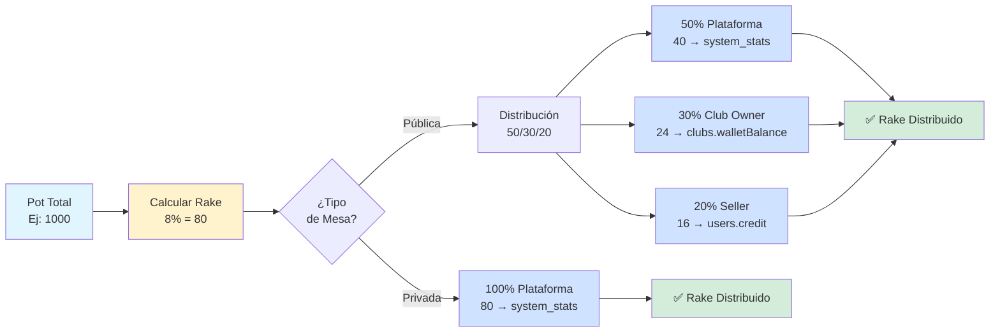
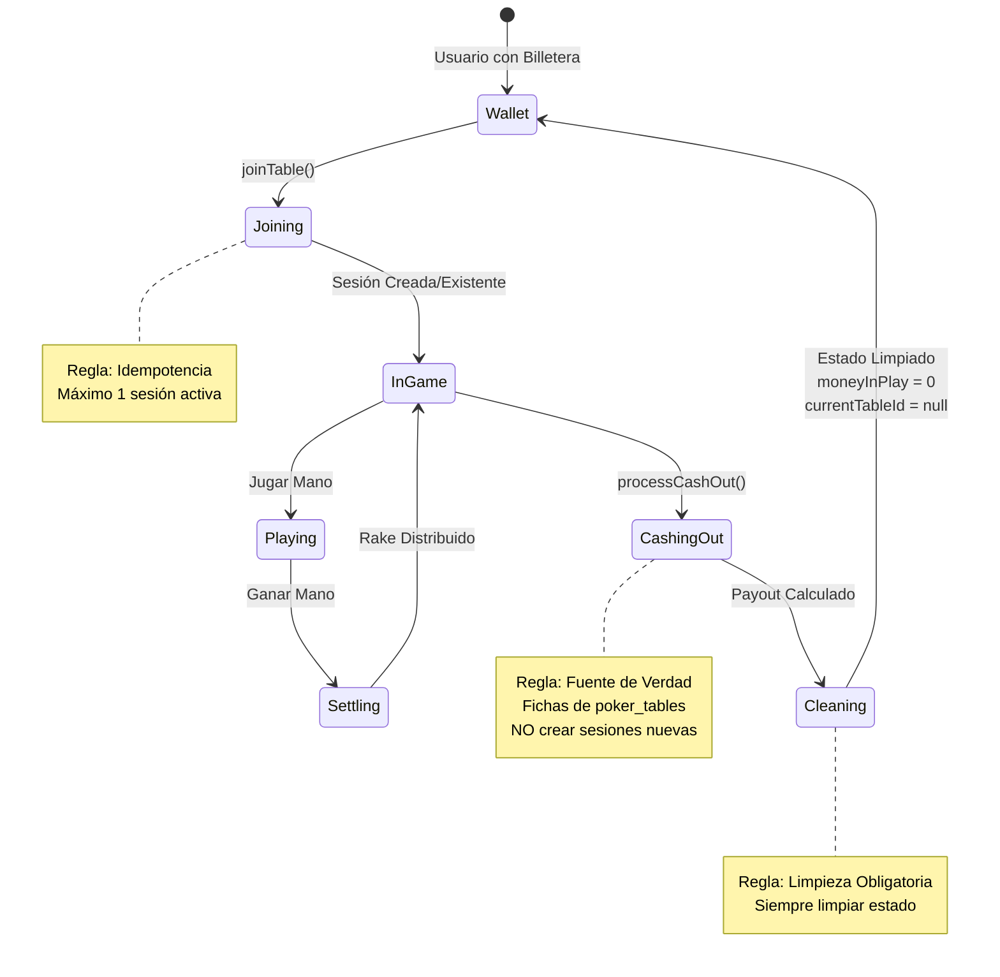
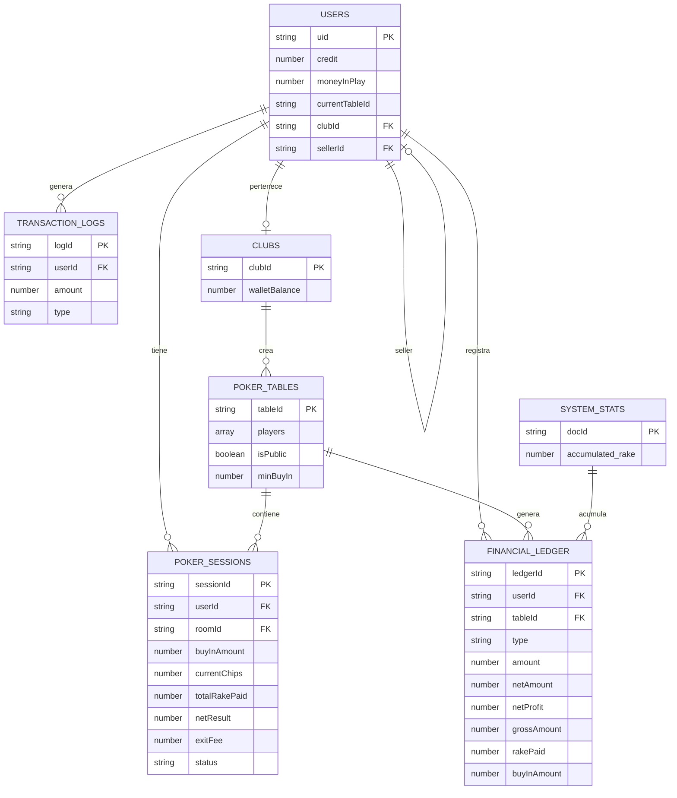
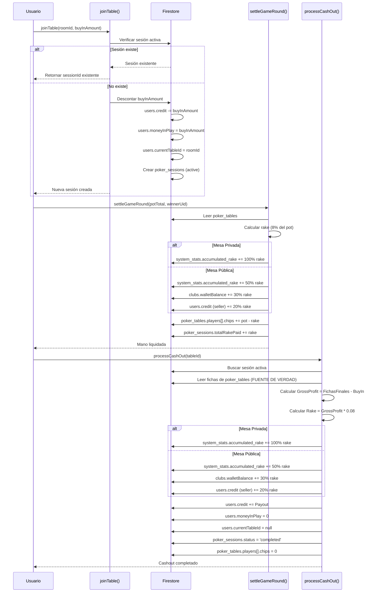

# 🔄 Diagrama de Arquitectura: Ciclo Económico de Antigravity Poker

## Diagrama de Flujo Completo

```mermaid
flowchart TD
    Start([Usuario con Billetera]) --> CheckBalance{¿Tiene<br/>suficiente<br/>balance?}
    
    CheckBalance -->|No| Insufficient[❌ Error:<br/>Balance Insuficiente]
    CheckBalance -->|Sí| JoinTable[joinTable]
    
    JoinTable --> ValidateRoom{¿roomId<br/>válido?}
    ValidateRoom -->|No 'new_room'| ErrorInvalid[❌ Error:<br/>Room ID Inválido]
    ValidateRoom -->|Sí| CheckSession{¿Sesión<br/>activa<br/>existe?}
    
    CheckSession -->|Sí| ReturnExisting[✅ Retornar<br/>Sesión Existente<br/>IDEMPOTENCIA]
    CheckSession -->|No| CreateSession[Crear Nueva Sesión]
    
    CreateSession --> DeductBuyIn[Descontar BuyIn<br/>credit -= buyInAmount]
    DeductBuyIn --> SetState[Establecer Estado<br/>moneyInPlay = buyInAmount<br/>currentTableId = tableId]
    SetState --> CreateSessionDoc[Crear poker_sessions<br/>status: 'active']
    CreateSessionDoc --> LogDebit[Registrar en<br/>transaction_logs<br/>type: 'debit']
    
    ReturnExisting --> InGame[🎮 Usuario en Mesa]
    CreateSessionDoc --> InGame
    LogDebit --> InGame
    
    InGame --> PlayHand[Jugar Mano]
    PlayHand --> UpdateChips[Actualizar Fichas<br/>poker_tables.players[].chips<br/>FUENTE DE VERDAD]
    
    UpdateChips --> CheckWin{¿Ganó<br/>la mano?}
    CheckWin -->|No| PlayHand
    CheckWin -->|Sí| SettleRound[settleGameRound]
    
    SettleRound --> CalculatePot[Calcular Pot Total]
    CalculatePot --> CalculateRake[Calcular Rake<br/>Rake = Pot * 0.08]
    CalculateRake --> CheckTableType{¿Mesa<br/>Pública?}
    
    CheckTableType -->|Privada| DistributePrivate[Distribuir Rake<br/>100% → Plataforma<br/>system_stats.accumulated_rake]
    CheckTableType -->|Pública| DistributePublic[Distribuir Rake<br/>50% → Plataforma<br/>30% → Club Owner<br/>20% → Seller]
    
    DistributePrivate --> UpdateWinnerStack[Actualizar Stack Ganador<br/>poker_tables.players[].chips<br/>+= Pot - Rake]
    DistributePublic --> UpdateWinnerStack
    
    UpdateWinnerStack --> UpdateSession[Actualizar Sesión<br/>totalRakePaid += rake]
    UpdateSession --> LogWin[Registrar en<br/>financial_ledger<br/>type: 'GAME_WIN']
    LogWin --> PlayHand
    
    InGame --> CashOut[processCashOut]
    
    CashOut --> FindSession{¿Sesión<br/>activa<br/>existe?}
    FindSession -->|No| ErrorNoSession[❌ Error:<br/>No se encontró<br/>sesión activa<br/>PROHIBIDO CREAR]
    FindSession -->|Sí| ReadChips[Leer Fichas de Mesa<br/>poker_tables.players[].chips<br/>FUENTE DE VERDAD]
    
    ReadChips --> CalculateGross[Calcular GrossProfit<br/>GrossProfit = FichasFinales - BuyIn]
    CalculateGross --> CheckProfit{¿GrossProfit<br/>> 0?}
    
    CheckProfit -->|No| NoRake[Rake = 0<br/>Payout = FichasFinales]
    CheckProfit -->|Sí| CalculateExitRake[Calcular Rake de Salida<br/>Rake = GrossProfit * 0.08]
    
    CalculateExitRake --> CheckTableType2{¿Mesa<br/>Pública?}
    CheckTableType2 -->|Privada| DistributeExitPrivate[Distribuir Rake<br/>100% → Plataforma]
    CheckTableType2 -->|Pública| DistributeExitPublic[Distribuir Rake<br/>50% → Plataforma<br/>30% → Club Owner<br/>20% → Seller]
    
    DistributeExitPrivate --> CalculatePayout[Calcular Payout<br/>Payout = FichasFinales - Rake]
    DistributeExitPublic --> CalculatePayout
    NoRake --> CalculatePayout
    
    CalculatePayout --> TransferCredit[Transferir a Billetera<br/>credit += Payout]
    TransferCredit --> CleanState[LIMPIEZA OBLIGATORIA<br/>moneyInPlay = 0<br/>currentTableId = null]
    
    CleanState --> CloseSession[Cerrar Sesión<br/>poker_sessions<br/>status: 'completed']
    CloseSession --> ClearTableChips[Limpiar Fichas en Mesa<br/>poker_tables.players[].chips = 0]
    ClearTableChips --> LogCashOut[Registrar en<br/>financial_ledger<br/>type: 'SESSION_END']
    LogCashOut --> LogCredit[Registrar en<br/>transaction_logs<br/>type: 'credit']
    LogCredit --> End([✅ Usuario fuera de Mesa<br/>Dinero en Billetera])
    
    style Start fill:#e1f5ff
    style End fill:#d4edda
    style ErrorInvalid fill:#f8d7da
    style ErrorNoSession fill:#f8d7da
    style Insufficient fill:#f8d7da
    style InGame fill:#fff3cd
    style CleanState fill:#d1ecf1
    style ReturnExisting fill:#d4edda
    style ReadChips fill:#d1ecf1
    style DistributePrivate fill:#cfe2ff
    style DistributePublic fill:#cfe2ff
    style DistributeExitPrivate fill:#cfe2ff
    style DistributeExitPublic fill:#cfe2ff
```

---

## Diagrama de Distribución del Rake



---

## Diagrama de Estados del Usuario



---

## Diagrama de Colecciones y Relaciones



---

## Flujo de Datos: Ejemplo Completo



---

## Leyenda

- 🟢 **Verde:** Operaciones exitosas
- 🟡 **Amarillo:** Procesos en curso
- 🔵 **Azul:** Distribución de rake
- 🔴 **Rojo:** Errores o validaciones fallidas
- ⚪ **Blanco:** Estados intermedios

---

**Última actualización:** 2024  
**Versión:** 1.0.0

