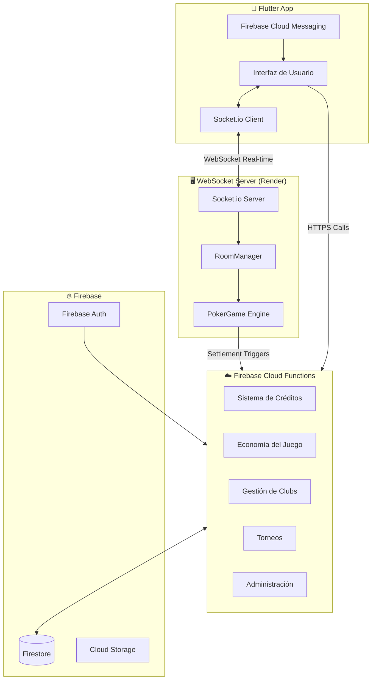
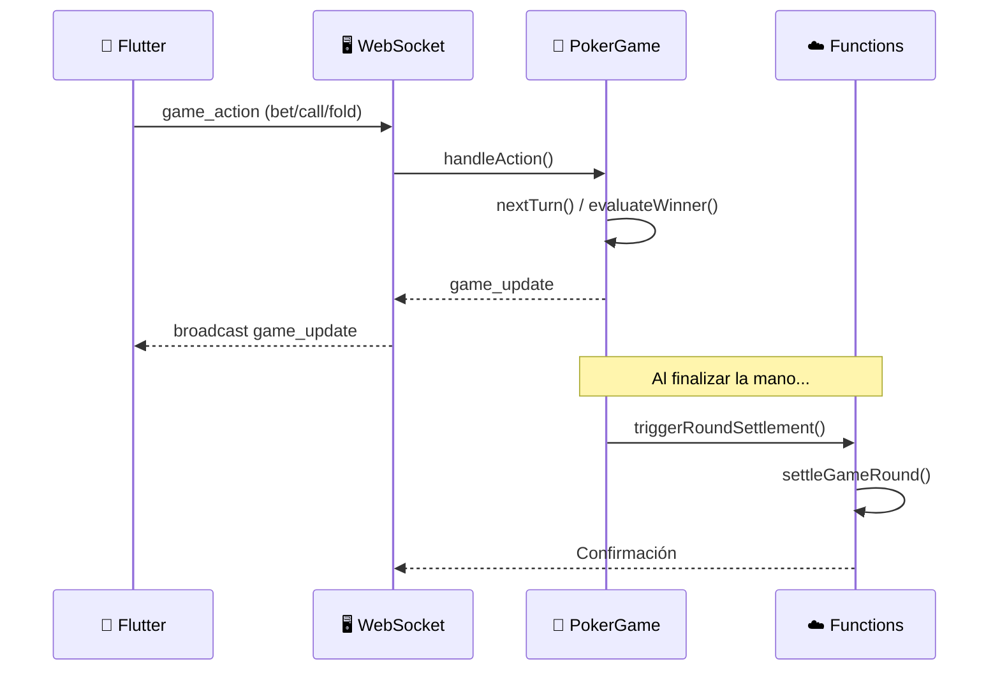
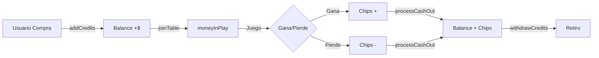

# 🃏 Poker Imperial

Sistema completo de poker en tiempo real con arquitectura distribuida: **WebSocket Server** (Render) + **Firebase Cloud Functions** (Economía y Lógica de Juego) + **Flutter App** (Frontend Multi-plataforma).

---

## 📐 Arquitectura General



---

## 🗂️ Estructura del Proyecto

```
/Poker
├── /app                    # 📱 Flutter Frontend
│   ├── /lib
│   │   ├── /screens        # Pantallas (GameScreen, Lobby, etc.)
│   │   ├── /services       # SocketService, AuthService
│   │   └── /widgets        # Componentes UI
│   └── pubspec.yaml
│
├── /server                 # 🖥️ WebSocket Server (Render)
│   ├── /src
│   │   ├── index.ts        # Entry point + Socket.io handlers
│   │   ├── /game
│   │   │   ├── RoomManager.ts    # Gestión de salas/mesas
│   │   │   ├── PokerGame.ts      # Lógica del juego de poker
│   │   │   └── BotLogic.ts       # Lógica de bots
│   │   └── /middleware
│   │       └── firebaseAuth.ts   # Verificación de tokens
│   └── package.json
│
├── /functions              # ☁️ Firebase Cloud Functions
│   ├── /src
│   │   ├── index.ts        # Export de todas las functions
│   │   ├── /functions
│   │   │   ├── credits.ts        # Sistema de créditos
│   │   │   ├── gameEconomy.ts    # Economía in-game
│   │   │   ├── club.ts           # Gestión de clubs
│   │   │   ├── tournament.ts     # Sistema de torneos
│   │   │   ├── admin.ts          # Funciones admin
│   │   │   ├── analytics.ts      # Métricas y estadísticas
│   │   │   └── ...
│   │   └── /utils
│   └── package.json
│
└── firestore.rules         # 🔐 Reglas de seguridad Firestore
```

---

## 🖥️ WebSocket Server (Render)

El servidor WebSocket es el **corazón del juego en tiempo real**. Maneja todas las conexiones de socket, estado del juego y comunicación entre jugadores.

### Ubicación: `/server`

### Responsabilidades:

| Componente | Función |
|------------|---------|
| **index.ts** | Entry point, manejo de eventos socket (`create_room`, `join_room`, `game_action`, etc.) |
| **RoomManager** | Crear/eliminar salas, gestionar jugadores, countdown para inicio, cleanup automático |
| **PokerGame** | Motor de Texas Hold'em: rondas, turnos, apuestas, evaluación de manos, side pots |

### Eventos Socket Principales:

```typescript
// Conexión y Autenticación
'authenticate'      // Verificar token Firebase
'authenticated'     // Confirmación de auth

// Gestión de Salas
'create_room'       // Crear mesa de poker
'join_room'         // Unirse a una mesa
'join_spectator'    // Unirse como espectador
'leave_room'        // Salir de la mesa
'player_ready'      // Marcar jugador listo

// Acciones de Juego
'start_game'        // Iniciar la partida
'game_action'       // bet, call, fold, check, allin
'game_update'       // Estado actualizado del juego
'hand_winner'       // Resultado de la mano

// Eventos de Sistema
'player_disconnected'
'force_disconnect'  // Kick de jugador
```

### Flujo de una Mano:



### Deploy en Render:

```yaml
# render.yaml
services:
  - type: web
    name: poker-backend
    runtime: node
    buildCommand: cd server && npm install && npm run build
    startCommand: cd server && npm start
    envVars:
      - key: GAME_SECRET
        sync: false
```

---

## ☁️ Firebase Cloud Functions

Las Cloud Functions manejan **toda la lógica económica y operaciones sensibles** que requieren autorización del servidor.

### Ubicación: `/functions`

### Categorías de Functions:

#### 💰 Sistema de Créditos (`credits.ts`)

```typescript
addCreditsFunction        // Añadir créditos (compra/mint)
deductCreditsFunction     // Deducir créditos (apuestas)
withdrawCreditsFunction   // Retirar créditos
adminWithdrawCreditsFunction  // Admin: retirar de cualquier usuario
```

#### 🎮 Economía del Juego (`gameEconomy.ts`)

```typescript
joinTableFunction         // Unirse a mesa (reserva de créditos)
processCashOutFunction    // Cashout al salir de mesa
settleGameRoundFunction   // Liquidar ronda (rake, ganador)
universalTableSettlementFunction  // Cierre forzado de mesa
```

> **Flujo Económico:**
> 1. `joinTable`: Deduce `moneyInPlay` del balance → Reserva créditos
> 2. Durante juego: Chips fluctúan en memoria del servidor
> 3. `processCashOut`: Devuelve chips al balance → Limpia `moneyInPlay`

#### 🏢 Clubs (`club.ts`, `clubWallet.ts`)

```typescript
createClubFunction
joinClubFunction
leaveClubFunction
ownerTransferCreditFunction   // Dueño transfiere a miembro
sellerTransferCreditFunction  // Vendedor transfiere
```

#### 🏆 Torneos (`tournament.ts`, `tournamentAdmin.ts`)

```typescript
createTournamentFunction
registerForTournamentFunction
startTournamentFunction
adminPauseTournamentFunction
adminForceBlindLevelFunction
```

#### 🛡️ Administración (`admin.ts`)

```typescript
adminSetUserRoleFunction      // Cambiar rol de usuario
adminMintCreditsFunction      // Crear créditos
getSystemStatsFunction        // Estadísticas del sistema
bootstrapAdminFunction        // Crear primer admin
repairStuckSessions          // Reparar sesiones colgadas
```

#### 📊 Analytics (`analytics.ts`)

```typescript
getTopHoldersFunction
getTopWinners24hFunction
get24hMetricsFunction
getWeeklyTrendsFunction
getTotalRakeFunction
```

### Seguridad con HMAC:

Las operaciones críticas del servidor usan **firma HMAC-SHA256**:

```typescript
// Server genera firma
const authPayload = JSON.stringify({ uid, tableId, chips, timestamp });
const signature = crypto.createHmac('sha256', GAME_SECRET)
                       .update(authPayload).digest('hex');

// Function verifica
function verifySignature(authPayload: string, signature: string): boolean {
    const expected = crypto.createHmac('sha256', GAME_SECRET)
                          .update(authPayload).digest('hex');
    return crypto.timingSafeEqual(Buffer.from(expected), Buffer.from(signature));
}
```

---

## 📱 Flutter App

El frontend multi-plataforma consume tanto el WebSocket como las Cloud Functions.

### Ubicación: `/app`

### Servicios Clave:

| Servicio | Función |
|----------|---------|
| **SocketService** | Conexión WebSocket, emisión y escucha de eventos |
| **AuthService** | Autenticación Firebase, manejo de tokens |
| **GameProvider** | Estado del juego, acciones de poker |

### Pantallas Principales:

- `GameScreen`: Mesa de poker con cartas, jugadores, acciones
- `LobbyScreen`: Lista de mesas disponibles
- `TournamentLobbyScreen`: Sala de espera de torneos
- `WalletScreen`: Balance y transacciones
- `AdminDashboard`: Panel de administración

---

## 🔐 Sistema de Roles

| Rol | Permisos |
|-----|----------|
| **admin** | Control total, mintear créditos, estadísticas globales |
| **club** | Crear mesas/torneos de club, transferir créditos |
| **seller** | Transferir créditos a jugadores |
| **player** | Jugar, comprar créditos, unirse a mesas |

---

## 🚀 Despliegue

### Server (Render)

```bash
cd server
npm install
npm run build
# Deploy en Render con variables de entorno
```

### Functions (Firebase)

```bash
cd functions
npm install
npm run build
firebase deploy --only functions
```

### Variables de Entorno Requeridas:

| Variable | Ubicación | Descripción |
|----------|-----------|-------------|
| `GAME_SECRET` | Server + Functions | Secreto compartido para HMAC |
| `FIREBASE_CONFIG` | Server | Credenciales de Firebase Admin |
| `PORT` | Server | Puerto del WebSocket (default: 3000) |

---

## 📈 Flujo Económico Completo



---

## 🛠️ Desarrollo Local

```bash
# 1. Server WebSocket
cd server
npm install
npm run dev  # Puerto 3000

# 2. Functions (Emuladores)
cd functions
npm install
firebase emulators:start --only functions

# 3. Flutter App
cd app
flutter pub get
flutter run
```

---

## 📚 Documentación Adicional

- [DEPLOY_RAPIDO.md](./DEPLOY_RAPIDO.md) - Guía rápida de despliegue
- [DIAGRAMA_CICLO_ECONOMICO.md](./DIAGRAMA_CICLO_ECONOMICO.md) - Flujo económico detallado
- [README_FIREBASE.md](./README_FIREBASE.md) - Configuración Firebase
- [INTEGRACION_RAILWAY.md](./INTEGRACION_RAILWAY.md) - Deploy alternativo en Railway

---

*Desarrollado con ❤️ usando Flutter, Node.js, Socket.io y Firebase*
